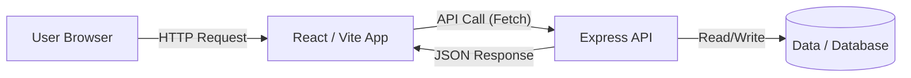

# Tech Stack, Architecture & Features Documentation

## 1. Technology Stack Implementation

This project uses the **MERN Stack** (MongoDB, Express, React, Node.js) with modern tooling for performance and developer experience.

### **Frontend (The Client)**
- **Core Framework:** [React 18](https://react.dev/)
  - *Why:* Component-based architecture allows for reusable UI parts (Header, Footer, Cards). Virtual DOM ensures fast updates.
- **Build Tool:** [Vite](https://vitejs.dev/)
  - *Why:* Significantly faster start and build times compared to Create React App (CRA). Uses native ES modules in development.
- **Styling:** [Tailwind CSS](https://tailwindcss.com/)
  - *Why:* Utility-first CSS allows for rapid UI development without writing custom CSS files. Ensures design consistency.
- **Animations:** [Framer Motion](https://www.framer.com/motion/)
  - *Why:* specific library for complex orchestrations (like the entrance animations on Home page).
- **Routing:** [React Router v6](https://reactrouter.com/)
  - *Why:* Enables "Single Page Application" (SPA) behavior. Users navigate without reloading the page.

### **Backend (The Server)**
- **Runtime:** [Node.js](https://nodejs.org/)
- **Framework:** [Express.js](https://expressjs.com/)
  - *Why:* Minimalist web framework. Easy to set up routes and middleware.
- **Security:** [Helmet](https://helmetjs.github.io/)
  - *Why:* Automatically sets various HTTP headers to secure the app against common vulnerabilities.
- **Performance:** [Compression](https://www.npmjs.com/package/compression)
  - *Why:* Gzip compresses HTTP responses, reducing payload size by ~70% for faster loading on slow networks.

### **Database**
- **Type:** JSON Files (Currently observed strategy) / MongoDB (Implied by MERN context, but code currently reads local data or external APIs).
  - *Observation:* The project structure contains a `server/data` folder, suggesting a flat-file database approach for simplicity in this phase, or as a seed source.

---

## 2. System Architecture

The application follows a **Client-Server Architecture**.



1.  **User Request:** User visits the website. Nginx/Vercel handles the initial HTML load.
2.  **Client-Side Routing:** React Router handles navigation locally.
3.  **Data Fetching:** The React app requests specific data (e.g., `/api/projects`) from the Express server.
4.  **API Processing:** Express receives the request, applies middleware (CORS, Security), finds the correct route, executes logic, and returns JSON.

---

## 3. Key Feature: Custom Caching Strategy

You asked about "what type of caching" we use. We use a **Stale-While-Revalidate (SWR)** strategy implemented in a custom hook.

**Location:** `client/src/hooks/useDataFetch.js`

### How it works:
Instead of just fetching data every time, the hook does this:

1.  **Check Cache:** Looks in `sessionStorage` for a key like `db_cache_/api/projects`.
2.  **Serve Immediate (Stale):** If data exists, it updates the UI *immediately* (0ms latency for the user).
3.  **Fetch Network (Revalidate):** It *silently* fetches the latest data from the server in the background.
4.  **Update if Different:** Once the network request finishes, it updates the UI with the fresh data and updates the cache.

### Why this is powerful:
-   **Instant Navigation:** When a user goes back to the "Projects" page, it loads instantly because it's reading from local memory.
-   **Always Content:** Users rarely see loading spinners on repeated visits.
-   **Self-Healing:** If the data on the server changed, the UI updates automatically a moment later.

```javascript
// Simplified Logic from useDataFetch.js
if (cachedData) {
  setData(cachedData); // Show cached version INSTANTLY
}
// Then fetch actual data
const freshData = await fetch(api);
setData(freshData); // Update with fresh version
sessionStorage.setItem(key, freshData); // Update cache
```

---

## 4. Modularity

The codebase is highly modular, following the **Separation of Concerns** principle.

### **Frontend Modularity**
-   **`src/components`**: (Atoms/Molecules) Small, reusable pieces like Buttons, Cards. They don't know about business logic, they just show data.
-   **`src/pages`**: (Organisms) Large views that assemble components. These are connected to Routes.
-   **`src/hooks`**: (Logic Layer) Custom logic like `useDataFetch`. This separates *logic* (how to get data) from *view* (how to show data).
-   **`src/utils`**: (Helpers) Pure functions and constants (animations, text formatting).

### **Backend Modularity**
-   **`server/index.js`**: The Entry Point. Only handles setup (middleware, port listening).
-   **`server/routes/`**: Distinct files for different resources (`projects.js`, `members.js`). This prevents having one massive list of routes.
-   **`server/controllers/`**: (Best Practice) Actual logic resides here, separating "Routing" from "Business Logic".
-   **`server/middleware/`**: Shared functions that run before requests (like Auth checks or Error handling).

### Why split it this way?
If you want to change how "Projects" look, you go to `client`.
If you want to change how "Projects" are stored, you go to `server`.
If you want to change the database password, you check `.env`.
This makes the codebase **maintainable** and **scalable**.
